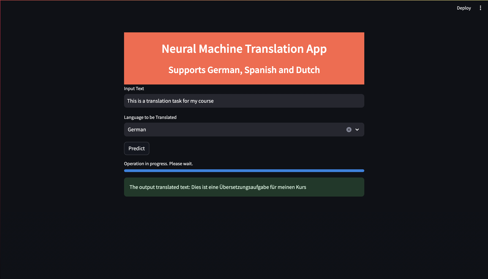

# Overview
This project focuses on developing and fine-tuning various sequence-to-sequence (Seq2Seq) models using the Europarl dataset. The models employed in this project include MBart, MarianMT, and NLLB transformer models. Additionally, a basic Seq2Seq model utilizing Byte Pair Encoding (BPE) and multilingual vocabulary with Bahdanau Attention and GRUs has been developed.

# Models
## MBart
An Encoder-Decoder model that can handle multilingual translations. This model behaves like an autoregressive model used for images where in place of image, corrupted text is learnt by the model to produce correct translations and uses SentencePiece tokenization method. The model is built of 12 layers of encoder and decoder with a total of 680M parameters.

## MarianMT
The MarianMT is a similar model where a single model will not support all languages. The above models exist where a single model supports multilingual translation. Here we have to change source and target language codes. The cross attention mechanism is a key component in MarianMT's architecture where it enables the decoder to attend to the encoded representations of the source sentence while generating the translation.

## NLLB
NLLB is another multilingual model devised to offer high-quality translations for a wide array of languages, including low-resource languages. In NLLB there is a concept called Noisy Channel Mode which introduces random perturbations to input text, mimicking real-world noise. This forces the model to learn robust representations, improving translation accuracy, especially for low-resource languages with limited clean data.

## Custom Seq2Seq Model
We developed a basic model following the pytorch implementation using Bahdanau Attention. We used Byte Pair Encoding which has a multilingual vocabulary of size 100K. We encoded our input and target text with target text having a target language and the input text with a prefix which has: Translate to [Target Language]. We got the word indices and padded it to a dimension of 300 and made it pass through the encoder and learn. This development required more computing resources, but have provided the code on how we developed it.

# Results
The results of the trained models, including BLEU scores and qualitative analysis, are documented and MBart model worked fine upon Fine Tuning.

### MBart 

Source Text: The content of the proposal concerns the average 48-hour working week of
doctors, with the possibility, following negotiation, of increasing it to 54 hours.

Target Text: (German) Dieser Vorschlag sieht eine durchschnittliche wöchentliche Arbeitszeit für Ärzte von 48 Stunden vor, die nach Vereinbarung bis zu 54 Stunden betragen kann.

Basic Predicted Text: Der Inhalt des Vorschlags bezieht sich auf die durchschnittliche 48-Stunden-Woche der Ärzte mit der Möglichkeit, sie nach Verhandlungen auf 54 Stunden zu erhöhen.

Fine Tuned Predicted Text: Der Vorschlag bezieht sich im Inhalt auf die durchschnittliche 48-Stunden-Woche-Beschäftigung von Ärzten mit der Möglichkeit, sie nach Verhandlungen auf 54 Stunden zu erhöhen.

### NLLB

Source Text: It is now February and we are still waiting.

Target Text (Dutch): Het kan goed zijn dat de anderen geen haar beter zijn, maar dat helpt ons niet.

Predicted Text (Basic) : È ora febbraio e stiamo ancora aspettando. 

Predicted Text(Fine tuned):Het is nu februari en we wachten nog steeds.

### MarianMT

#### Dutch Model
Source Text: Mr President, the European Parliament is today facing an important decision. 

Target Text: Mijnheer de Voorzitter, beste collega's, het Europees Parlement staat vandaag voor een belangrijke beslissing.

Predicted Text (Basic): Mijnheer de Voorzitter, het Europees Parlement staat vandaag voor een belangrijk besluit.

Predicted Text(Fine-tuned): Mijnheer de Voorzitter, het Europees Parlement staat vandaag voor een belangrijke beslissing.

# Improvements
Training MBART for more epochs can give us good results. Also, there can be a good chance if Reinforcement Learning can improve the translation process. Using Reinforcement Learning with Human Feedback will improve NLP models taking it to new heights.

# Web Interface
We developed a web interface by selecting the most performed model which is MBart. We pushed our model to a HuggingFace repo and directly call and use it. The development was made using Python Streamlit.

