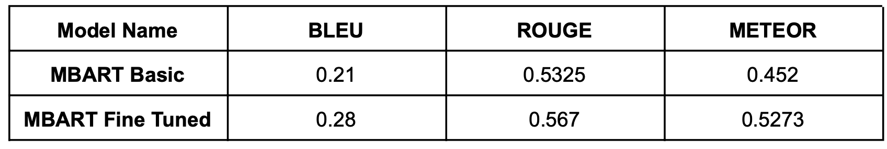

# Overview
This project focuses on developing and fine-tuning various sequence-to-sequence (Seq2Seq) models using the Europarl dataset. The models employed in this project include MBart, MarianMT, and NLLB transformer models. Additionally, a basic Seq2Seq model utilizing Byte Pair Encoding (BPE) and multilingual vocabulary with Bahdanau Attention and GRUs has been developed.

# Models
## MBart
MBart is a multilingual BART model that has been fine-tuned on the Europarl dataset to enhance its translation capabilities across multiple languages.

## MarianMT
MarianMT is a machine translation model developed by the Marian team. This project involves fine-tuning MarianMT on the Europarl dataset to improve its translation accuracy and efficiency.

## NLLB
NLLB (No Language Left Behind) is a transformer model focused on translation tasks. This project includes fine-tuning NLLB on the Europarl dataset to support multilingual translation.

## Custom Seq2Seq Model
A custom Seq2Seq model has been developed using Byte Pair Encoding (BPE) for tokenization and multilingual vocabulary. This model utilizes Bahdanau Attention with GRU units to perform translation tasks.

## Results
The results of the trained models, including BLEU scores and qualitative analysis, are documented and MBart model worked fine upon Fine Tuning.

### MBart 

Source Text: The content of the proposal concerns the average 48-hour working week of
doctors, with the possibility, following negotiation, of increasing it to 54 hours.

Target Text: (German) Dieser Vorschlag sieht eine durchschnittliche wöchentliche Arbeitszeit für Ärzte von 48 Stunden vor, die nach Vereinbarung bis zu 54 Stunden betragen kann.

Basic Predicted Text: Der Inhalt des Vorschlags bezieht sich auf die durchschnittliche 48-Stunden-Woche der Ärzte mit der Möglichkeit, sie nach Verhandlungen auf 54 Stunden zu erhöhen.

Fine Tuned Predicted Text: Der Vorschlag bezieht sich im Inhalt auf die durchschnittliche 48-Stunden-Woche-Beschäftigung von Ärzten mit der Möglichkeit, sie nach Verhandlungen auf 54 Stunden zu erhöhen.

### NLLB

Source Text: It is now February and we are still waiting.

Target Text (Dutch): Het kan goed zijn dat de anderen geen haar beter zijn, maar dat helpt ons niet.

Predicted Text (Basic) : È ora febbraio e stiamo ancora aspettando. 

Predicted Text(Fine tuned):Het is nu februari en we wachten nog steeds.

### MarianMT

#### Dutch Model
Source Text: Mr President, the European Parliament is today facing an important decision. 

Target Text: Mijnheer de Voorzitter, beste collega's, het Europees Parlement staat vandaag voor een belangrijke beslissing.

Predicted Text (Basic): Mijnheer de Voorzitter, het Europees Parlement staat vandaag voor een belangrijk besluit.

Predicted Text(Fine-tuned): Mijnheer de Voorzitter, het Europees Parlement staat vandaag voor een belangrijke beslissing.

